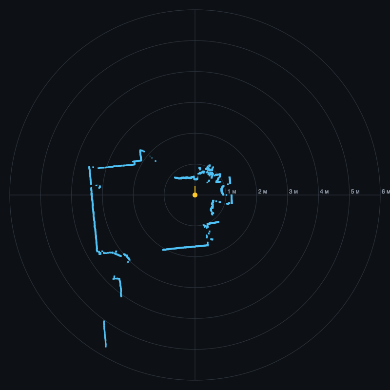
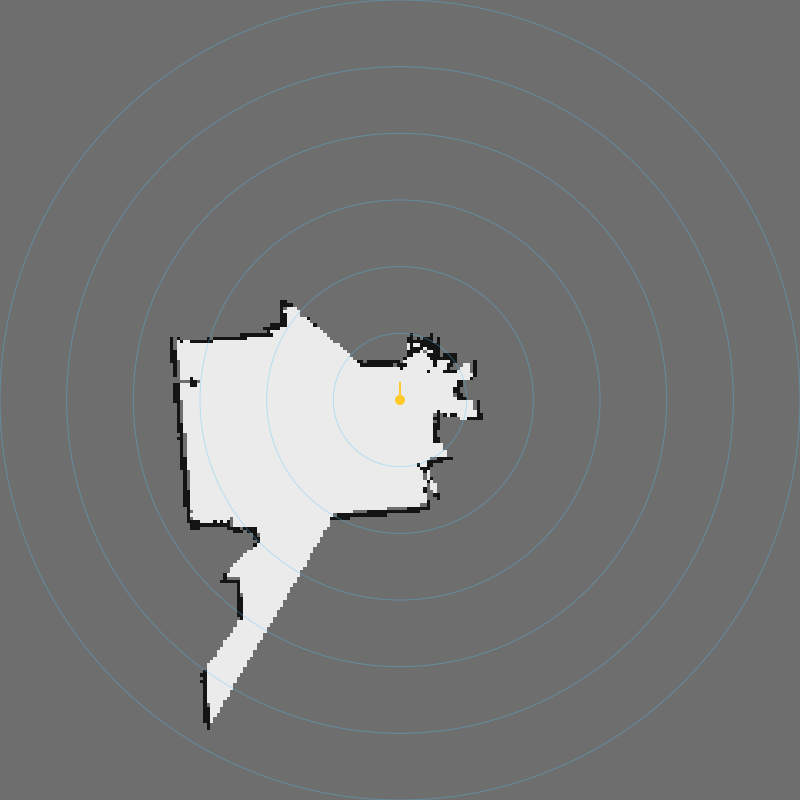

# FM1828 lidar — Ecovacs DEEBOT T8 / T9 / N8 Pro dToF LDS unit

Reverse-engineered protocol, host library (Python), ESP32 driver (Arduino/PlatformIO), bridge firmware,
web GUI with a live map, and firmware-analysis tools for the **FM1828** («ToF Laser Sensor LDS Unit», 5 V 0.35 A)
sold as a spare part for ECOVACS DEEBOT T8 / T8 AIVI / T9 / T9 AIVI / N8 Pro / T10 / X1.

*Russian below. English summary:* UART 460800 8N1 (3.3 V); ASCII commands `startldspl$`, `startlds$`, `stoplds$`, `$`;
62-byte frames `FA idx speed dist[16] tail[24] sum16`, 90 frames × 16 points = 1440 points per revolution (0.25°), ~5 rev/s.
The lidar accepts a start only from a fresh (power-on / silent) state; after `stoplds$` the robot itself power-cycles it.

## Коротко

| Параметр | Значение |
| --- | --- |
| Интерфейс | UART **460800** 8N1, уровни 3.3 V, питание 5 V / 0.35 A |
| Запуск | `startldspl$` («plus startup» из прошивки робота); также `$` → 2 с → `startlds$` |
| Остановка | `stoplds$`; после неё старт принимается только после снятия питания (так делает робот) или после 11–16 минут тишины, когда лидар сам засыпает |
| Кадр простоя | `5A A5 hi lo` — дистанция в мм (big-endian) без вращения, ~1000 кадров/с |
| Кадр сканирования | 62 байта: `FA`, индекс `A0…F9`, скорость u16 LE, 16 × дистанция u16 LE (мм), 24 байта хвост, сумма u16 LE байтов 0…59 |
| Разрешение | 90 кадров × 16 точек = 1440 точек / оборот (0.25°), ≈ 4.5–5 об/с, ≈ 28 КБ/с |

## Скриншоты GUI

Веб-интерфейс из `python/fm1828_gui.py`, данные с лидара FM1828 (запись `captures/fm1828-spin-15s.bin`):





## Совместимость

Модуль навигации (LDS) роботов Ecovacs DEEBOT серий N8 / T8 / T9 / N10 / T10 / T20 / X1, маркировка платы **FM1828_JWT_V03**.
Совместимые модели DEEBOT (по данным продавцов запчастей):

| Серия | Модели |
| --- | --- |
| X1 | X1 Omni (D-X1OM), X1 Plus (D-X1PL), X1 Turbo (DEX11) |
| T20 / T10 | T20 Omni (DLX23), T10 Turbo (DBX23), T10 Plus (DBX33), T10 (DBX33) |
| T9 | T9 AIVI, T9 Plus (DLX13-54), T9 (DLX13-44) |
| T8 | T8 AIVI Plus (DBX11-11), T8 AIVI (DBX11-11), T8 Plus (DLX11-54), T8 (DLX11-44) |
| N10 | N10 (DBX41), N10 Plus (DBX41) |
| N8 | N8 PRO Plus (DLN11), N8 PRO (DLN11-11), N8 Plus (DLN26), N8 (DLN26-21) |

Протокол проверен на одном экземпляре FM1828; на других ревизиях платы могут отличаться детали.

Полное описание: [docs/protocol.md](docs/protocol.md). Как это было найдено и что робот делает с лидаром:
[docs/firmware-analysis.md](docs/firmware-analysis.md). Ссылки: [docs/links.md](docs/links.md).

## Подключение к ESP32

```
FM1828 TX  → ESP32 GPIO16 (RX2)
FM1828 RX  ← ESP32 GPIO17 (TX2)
FM1828 GND → GND
FM1828 VCC → 5 V (VIN)          опционально через ключ 5 В, управляемый GPIO4
```

## Состав репозитория

| Каталог | Содержимое |
| --- | --- |
| [`arduino/FM1828`](arduino/FM1828) | Arduino/PlatformIO-библиотека для ESP32: парсер, `start()/stop()/restart()`, колбэки точек и оборотов, управление ключом питания |
| [`python/`](python) | Python-пакет `fm1828` (парсер, драйвер через мост, воспроизведение дампов), веб-GUI со сканом и картой занятости, скрипты тестов |
| [`firmware/bridge`](firmware/bridge) | Прозрачный мост USB ↔ лидар на ESP32 (460800) с управлением ключом 5 В |
| [`firmware/probe`](firmware/probe) | Диагностический пробник: перебор команд, сырые дампы, ручной режим |
| [`firmware/demo`](firmware/demo) | Пример использования библиотеки на ESP32 |
| [`tools/`](tools) | Скачивание и расшифровка прошивки DEEBOT (порт `ecovacs-firmware-tools` на Python), поиск строк в squashfs |
| [`captures/`](captures) | Сырой дамп 15 с вращения для воспроизведения в GUI и лог перебора скоростей |

## Быстрый старт

1. Прошить `firmware/bridge` на ESP32 (`pio run -t upload`, скорость загрузки 115200).
2. `pip install -r python/requirements.txt`
3. Живой GUI: `python python/fm1828_gui.py --port /dev/cu.usbserial-10` → http://127.0.0.1:8765, кнопка «Запустить лидар».
   Без железа: `python python/fm1828_gui.py --replay captures/fm1828-spin-15s.bin`.
4. На роботе: `#include <FM1828.h>`, см. `arduino/FM1828/README.md`.

## Что не откалибровано

- Направление нуля и сторона вращения относительно корпуса (в GUI есть поворот и зеркалирование).
- Назначение 24-байтового хвоста кадра (байт 37 = 0x02, байты 38–39 = 16-битный счётчик) и единицы поля скорости (~30000 при ~5 об/с).
- Точная величина таймаута сна после `stoplds$` (наблюдалось 11–16 минут) и что именно его сбрасывает.

Лицензия MIT. Прошивки Ecovacs и их фрагменты в репозитории не хранятся.
